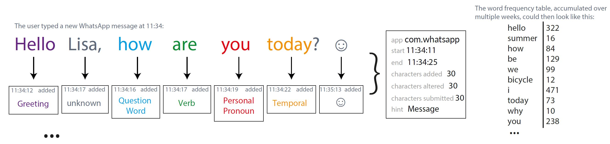

# Language Logger Research App (former "ResearchIME")

Language Logger is a research tool that enables **studies on mobile language use in the wild**. The LanguageLogger Android app can be installed on study participants' smartphones, where it replaces the smartphone's keyboard. **The app logs** when the user tyes words of predefined **word categories** (either just the category name or the raw word), count **word frequencies**, and log the usage of words that match a **regular expression**.

With this on-device language abstraction approach, **typed language on smartphones can be observed in the wild in a privacy-friendly manner**. No raw text data leaves the user's device.
Furthermore it is also possible to log touch data (typing speed, touch positions, ...), used messenger apps, and configure custom keyboard layouts for each study condition.



Please checkout the research papers about this tool for more details:

* [Bemmann, Buschek 2020. LanguageLogger: A Mobile Keyboard Application for Studying Language Use in Everyday Text Communication in the Wild](https://dl.acm.org/doi/pdf/10.1145/3397872)

* [Buschek, Bisinger, Alt 2018. ResearchIME: A mobile keyboard application for studying free typing behaviour in the wild](https://dl.acm.org/doi/abs/10.1145/3173574.3173829)


This GitHub project contains the clientside (Android App) of the research tool LanguageLogger. To manage the study configuration, and record the logged data, a backend is necessary. You can find it in this repo:

https://github.com/Flo890/languagelogger-backend


# Getting Started with the Android App

This Android is build on top of the Google Keyboard.
The Minimum required Android Version is `5.0`


## Open in Android Studio

* After opening the project, do not update the gradle version of the project. 
(if you realy would like to do so, you must disable Instant Run afterwards, as some used libraries do not support it)
* Android Studio tell you some SDK or Build Tool Versions are missing. Download and install them as prompted.

* Be aware that the App does not support the Android Emulator, as the modified Google Keyboard will only work on physical devices.

* You should configure the address of your server and the e-mail address of where participants can contact you.
Therefore you have do edit the following values in
`researchime-app/ResearchIME-Module/src/main/res/values/strings.xml`:
```xml
<string name="research_default_server_address" translatable="false">yourServerAddress</string>
```
and 
```xml
<string name="research_feedback_mail" translatable="false">yourResearchEmailAddress</string>
```

If you don't have a language logger server setup yet, checkout [the backend project's README](https://github.com/Flo890/languagelogger-backend/blob/master/README.md).

## Create a signed APK for Production

Before creating the APK make sure, that you configured the server address and your e-mail address as descriped above.

* Paste the content of your server's certificate into the file 
`languagelogger-app/ResearchIME-Module/src/main/res/raw/research_crt.cert`
* Uncomment the certificate check in `RestClient` (the line starting with `client.setSslSocketFactory(...`)
* Create a new certificate to sign the APK:
`keytool -genkey -keyalg RSA -alias researchime -keystore keystore.jks -storepass researchime -keysize 2048`
* Open Build -> Generate Signed APK, select generated `keystore.jks`, enter password and alias (researchime) 
* select Build Type Release and pick both signature versions
* Click finish to generate your APK


