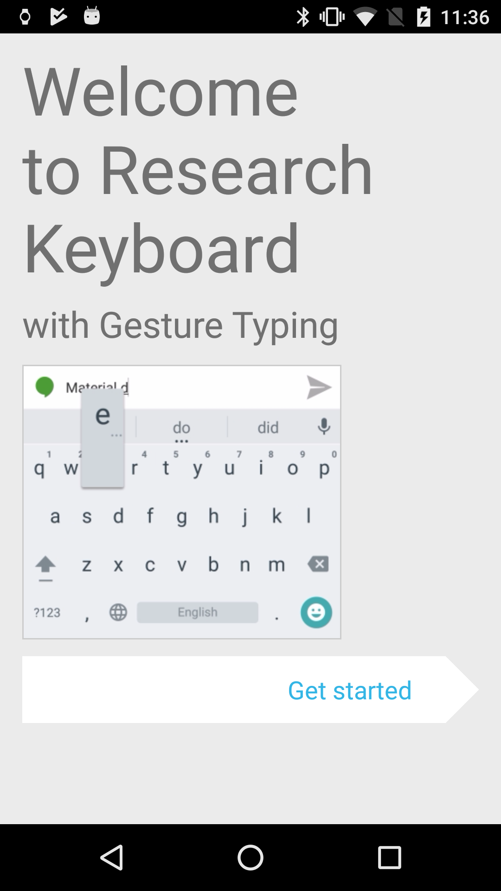
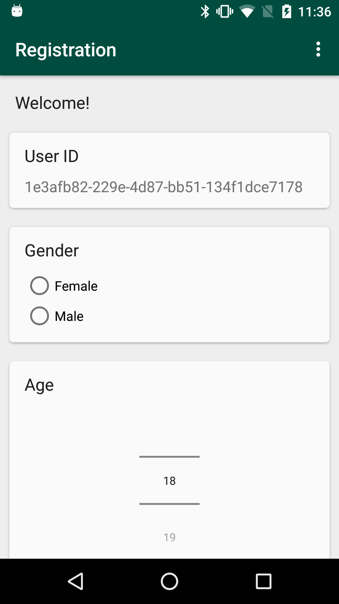
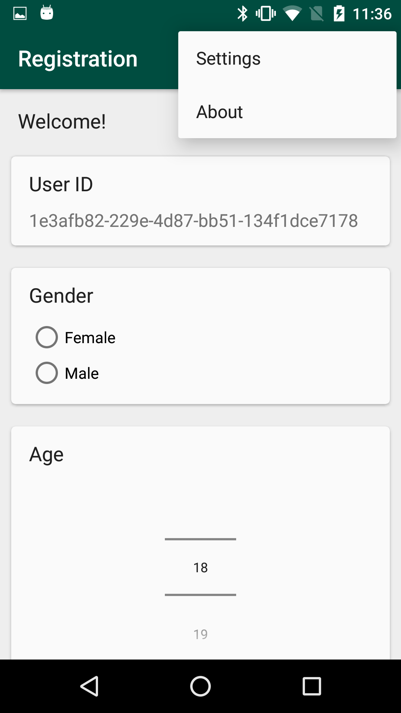
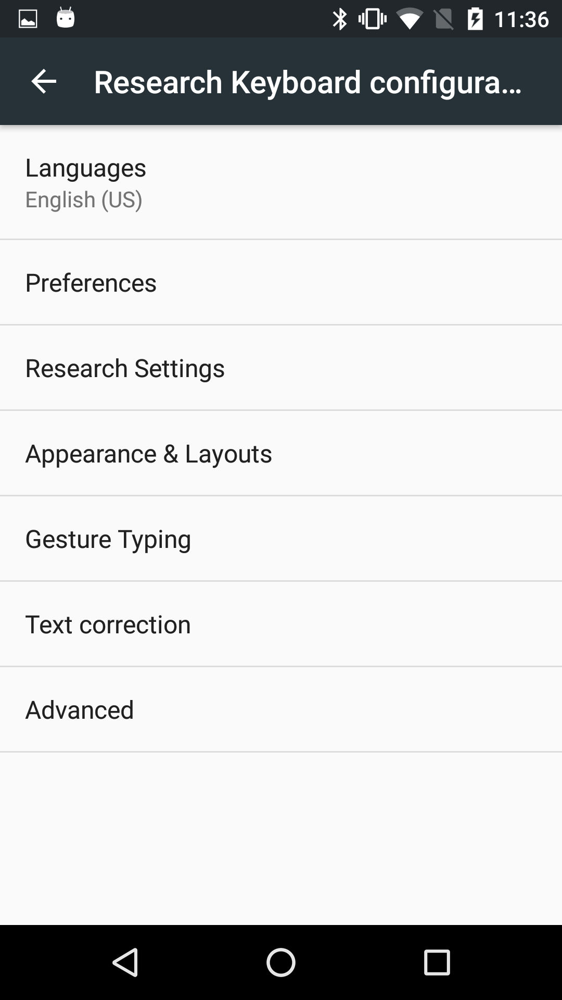
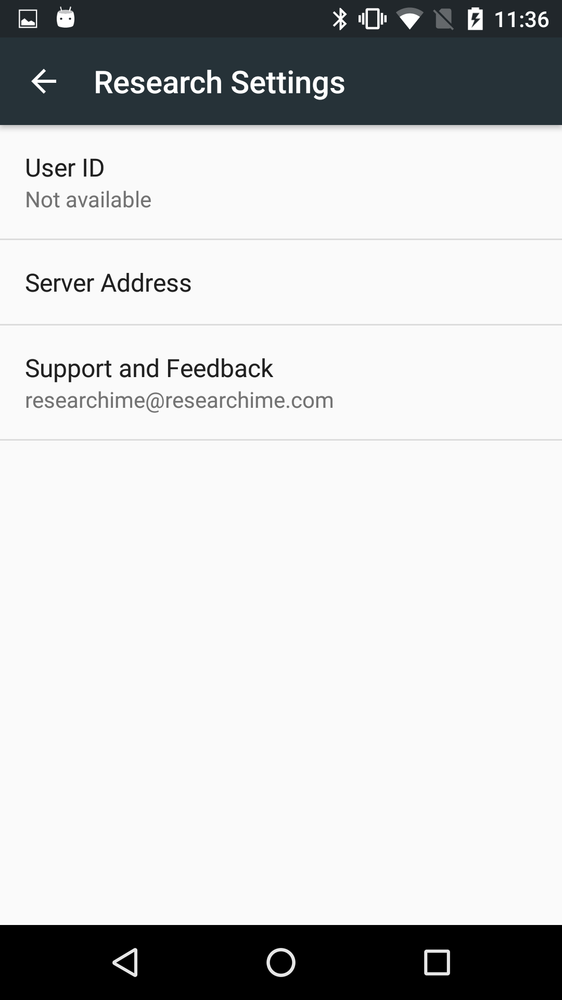
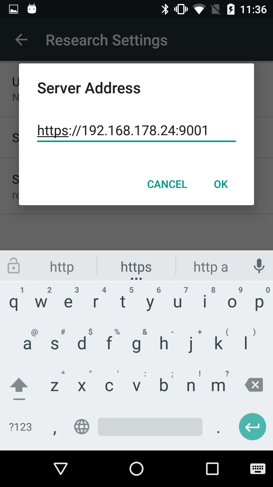

# ResearchIME Study App

Welcome to the repo for the ResearchIME Study App. In order to conduct user studies the system consists an Android App and a Web Server, which communicates with all the users smartphones but and allows the researcher to setup his study aswell as get overview of the collected keyboard events in form of an web interface.

The repository for the webserver can be found here:

https://gitlab.lrz.de/researchime/researchime-server

# Android App

This Android is build on top of the Google Keyboard.
The Minimum required Android Version is `5.0`

### Try it out: Download APK

There is a precompiled APK in `\apk`.

***However, for a real user study setup, you should open the project in Android Studio to sign and compile your own apk.***

When first starting App the user will be guided through a setup process.
With the precompiled APK, during the setup process the user has to set the server adress (which could be your PCs local IP address for example):


|                                        |                                        |                                        |                                        |                                        |
|----------------------------------------|----------------------------------------|----------------------------------------|----------------------------------------|----------------------------------------|----------------------------------------|
|||||||

Afterwards he can continue the registration.


## Open in Android Studio

* After opening the project, do not update the gradle version of the project. 
(if you realy would like to do so, you must disable Instant Run afterwards, as some used libraries do not support it)
* Android Studio tell you some SDK or Build Tool Versions are missing. Download and install them as prompted.

* Be aware that the App does not support the Android Emulator, as the modificated Google Keyboard will only work on physical devices.

* You should configure the address of your server and the e-mail address of where participants can contact you.
Therefore you have do edit the following values in
`researchime-app/ResearchIME-Module/src/main/res/values/strings.xml`:
```xml
<string name="research_default_server_address" translatable="false">yourServerAddress</string>
```
and 
```xml
<string name="research_feedback_mail" translatable="false">yourResearchEmailAdress</string>
```

## Create a signed APK for Production

Before creating the APK make sure, that you configured the server address and your e-mail address as descriped above.

* Download the `researchime.cert` file, which you generated in the server repo (you can use scp:
`scp user@server:/conf/researchime.cert` <target_path>)
* Paste the content of the file in
`researchime-app/ResearchIME-Module/src/main/res/raw/research_crt.cert`
This adds the servers certificate to the android app
* Create a new certificate to sign the APK:
`keytool -genkey -keyalg RSA -alias researchime -keystore keystore.jks -storepass researchime -keysize 2048`
* Open Build -> Generate Signed APK, select generated `keystore.jks`, enter password and alias (researchime) 
* select Build Type Release and pick both signature versions
* Click finish to generate your APK


